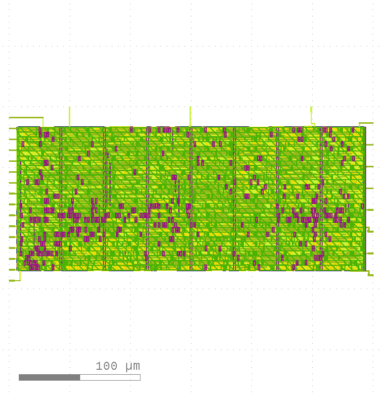
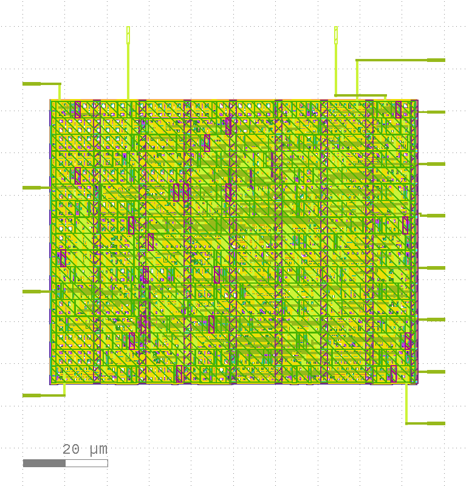
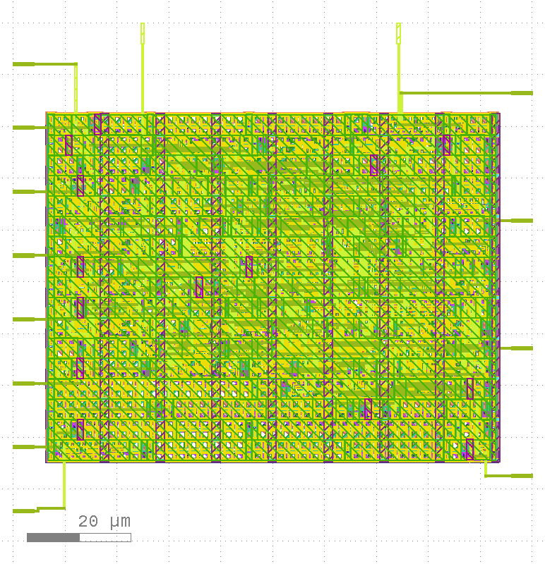

# XLS group submission

  

Group submission with example designs from https://github.com/google/xls.

## Projects

- 8-bit precision FPU: using DSLX stdlib [floating-point routines](https://google.github.io/xls/floating_point/).
  - 
- RLE: using DLSX [Run Length encoding module](https://github.com/google/xls/tree/main/xls/modules/rle).
  - 
  - 
